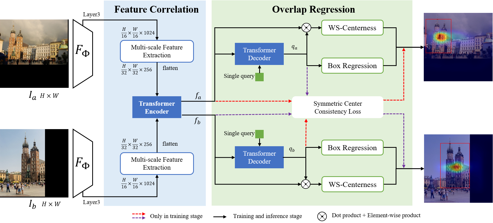

# Guide Local Feature Matching by Overlap Estimation
We introduce OETR, a neural network for overlap area estimation of image pairs, accepted by AAAI-2022. We are completing a series of code integration for image registration, including a series of feature point extraction and matching methods.

<p align="center">
  </a>
</p>

## Abstract
Local image feature matching under prominent appearance, viewpoint, and distance changes is challenging yet important. Conventional methods detect and match tentative local features across the whole images, with heuristic consistency checks to guarantee reliable matches. In this paper, we introduce a novel Overlap Estimation method conditioned on image pairs with TRansformer, named OETR, to constrain local feature matching in the commonly visible region. OETR performs overlap estimation in a two-step process of feature correlation and then overlap regression. As a preprocessing module, OETR can be plugged into any existing local feature detection and matching pipeline to mitigate potential view angle or scale variance. Intensive experiments show that OETR can substantially boost state-of-the-art local feature matching performance, especially for image pairs with small shared regions.


## Repository Overview
The repository is structured as follows:
- assets/: Some sample files.
- configs/: Training-related configuration files.
- dataset/: The directory of the datastore.
- dloc/: Inference pipeline implementation.
- doc/: Related documentation.
- scripts/: Execute scripts related to training and inference.
- src/: OETR implementation source code.
- third_party/: Some algorithms related to the inference part.
- weights/: Download the trained model weights file to the `weights` folder.

## Requirements
- Torch == 0.3.1
- Torchvision == 0.2.1
- Python == 3.6

For training and inference, all supported algorithm dependencies are presented in [requirements.txt](requirements.txt).
```
pip install requirements.txt
```


## Datasets
Generally, two parts of data are needed for OETR, the original training Megadepth datasets and the validation for relative pose estimation datasets.

### Training on Megadepth
For the MegaDepth dataset, we use depth maps provided in the [original MegaDepth dataset](https://www.cs.cornell.edu/projects/megadepth/) as well as undistorted images, corresponding camera intrinsic, and extrinsic preprocessed by [D2-Net](https://github.com/mihaidusmanu/d2-net#downloading-and-preprocessing-the-megadepth-dataset). You can download them separately from the following links.
- [MegaDepth undistorted images and processed depths](https://www.cs.cornell.edu/projects/megadepth/dataset/Megadepth_v1/MegaDepth_v1.tar.gz)
    - Note that we only use depth maps.
    - Path of the download data will be referred to as `/path/to/megadepth`
- [D2-Net preprocessed images](https://drive.google.com/drive/folders/1hxpOsqOZefdrba_BqnW490XpNX_LgXPB)
    - Images are undistorted manually in D2-Net since the undistorted images from MegaDepth do not come with corresponding intrinsics.
    - Path of the download data will be referred to as `/path/to/megadepth_d2net`

In order to avoid online calculation, we complete the calculation of the groundtruth of the overlap box offline through image depth, camera intrinsic, and extrinsic, and besides original dataset files(megadepth_train_pairs.txt and megadepth_validation_scale.txt) could be download from [here](https://drive.google.com/drive/folders/1xN56olSJIfqZ4i35ENoNeyt8Wi2m7iRA?usp=sharing)


### Validation on Megadepth
As we split the MegaDepth test set (with ten scenes) into subsets according to the overlap scale ratio for image pairs. We separate overlap scales into $[1, 2), [2, 3), [3, 4), [4, +\infty)$ and combine $[2, 3), [3, 4), [4, +\infty)$ as $[2, +\infty)$ for image pairs with noticeable scale difference. All datasets could be accessed from the assets folder. It could be download validation files from [here](https://drive.google.com/drive/folders/1D0u64-SaMufpTiBVQQAg7C1NpOtQSBNs?usp=sharing).


## Training
Different models configs are in the configs folder, and the OETR training script is:
``` shell
scripts/train.sh
```
> NOTE: It uses 2 GPUs only, with smaller image sizes of 640x640. Reproduction of paper results is not guaranteed under this setup.


## Inference pipeline
Please refer to [README.md](dloc/README.md) and topic structure referenced by https://github.com/cvg/Hierarchical-Localization.

## BibTex Citation

Please consider citing our work if you use any of the ideas presented in the paper or code from this repo:

```
@inproceedings{chen2022guide,
  title={Guide Local Feature Matching by Overlap Estimation},
  author={Chen, Ying and Huang, Dihe and Xu, Shang and Liu, Jianlin and Liu, Yong},
  booktitle={AAAI}},
  year={2022}
}
```
